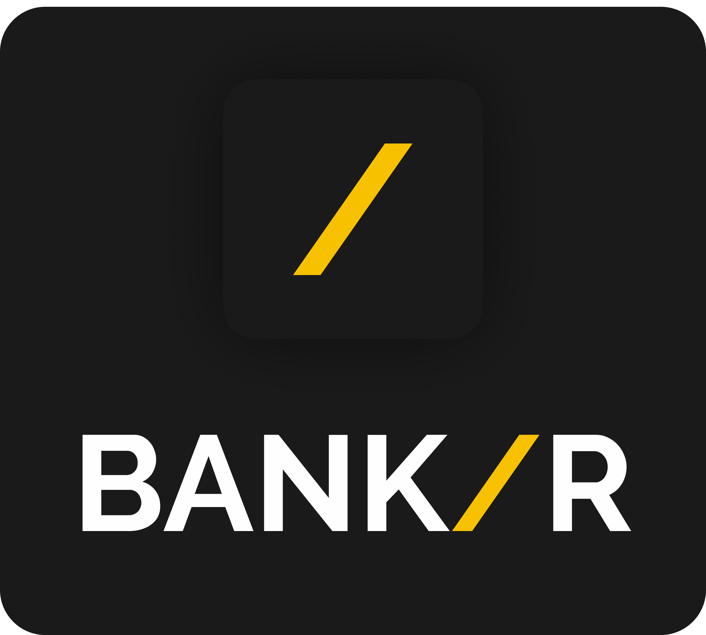


<!-- REPLACE ALL THE [userHP200104] TEXT WITH YOUR GITHUB PROFILE NAME & THE [Bankr] WITH THE NAME OF YOUR GITHUB PROJECT -->

<!-- Repository Information & Links-->
<br />


[![LinkedIn][linkedin-shield]][linkedin-url]
[![Behance][behance-shield]][behance-url]

<!-- HEADER SECTION -->
<h5 align="center" style="padding:0;margin:0;">Hansin Prema</h5>
<h5 align="center" style="padding:0;margin:0;">200104</h5>
<h6 align="center">Interactive Development 300</h6>
</br>
<p align="center">

  <a href="https://github.com/userHP200104/Bankr">
    
  </a>
  
  <h3 align="center">Bankr</h3>

  <p align="center">
    Private Bank Management System<br>
      <a href="https://github.com/userHP200104/Bankr"><strong>Explore the docs »</strong></a>
   <br />
   <br />
    <a href="https://github.com/userHP200104/Bankr/issues">Report Bug</a>
    ·
    <a href="https://github.com/userHP200104/Bankr/issues">Request Feature</a>
</p>
<!-- TABLE OF CONTENTS -->

## Table of Contents

* [About the Project](#about-the-project)
  * [Project Description](#project-description)
  * [Built With](#built-with)
* [Getting Started](#getting-started)
  * [Prerequisites](#prerequisites)
  * [How to install](#how-to-install)
* [Features and Functionality](#features-and-functionality)
* [Concept Process](#concept-process)
   * [Ideation](#ideation)
   * [Wireframes](#wireframes)
   * [User-flow](#user-flow)
* [Development Process](#development-process)
   * [Implementation Process](#implementation-process)
        * [Highlights](#highlights)
        * [Challenges](#challenges)
   * [Future Implementation](#future-implementation)
* [Final Outcome](#final-outcome)
    * [Video Demonstration](#video-demonstration)
* [Roadmap](#roadmap)
* [Contributing](#contributing)
* [License](#license)
* [Contact](#contact)
* [Acknowledgements](#acknowledgements)

<!--PROJECT DESCRIPTION-->
## About the Project
<!-- header image of project -->


### Project Description

A private bank mangement system that can only be manipulated by the admins of the app.

### Built With

* [.NET Maui](https://docs.microsoft.com/en-us/dotnet/maui/what-is-maui)
* [SQLite](https://www.sqlite.org/index.html)
* [Visual Studio](https://visualstudio.microsoft.com/vs/mac/)
* [GitHub](https://github.com/)

<!-- GETTING STARTED -->
<!-- Make sure to add appropriate information about what prerequesite technologies the user would need and also the steps to install your project on their own mashines -->
## Getting Started

The following instructions will get you a copy of the project up and running on your local machine for development and testing purposes.

### Prerequisites

Ensure that you have the latest version of [Visual Studio](https://visualstudio.microsoft.com/vs/mac/) installed on your machine.
### How to install

### Installation
Here are a couple of ways to clone this repo:

1. Clone Repository </br>
Run the following in the command-line to clone the project:
   ```sh
   git clone https://github.com/userHP200104/Bankr.git
   ```
    Open `Software` and select `File | Open...` from the menu. Select cloned directory and press `Open` button.

5. To get the required NuGet packages right-click on the `Dependencies Folder` and click on `Restore`.

6. To run the project click on `Play Button`.

7. On the login page enter the `ID`: "12345678" and `Password`: "12345678"


<!-- FEATURES AND FUNCTIONALITY-->
<!-- You can add the links to all of your imagery at the bottom of the file as references -->
</br>

## Features and Functionality
### Login

This page is for the admins to login. If a new admin whats access they need to be added directly to the server since not anyone can create an account to become an admin.

![image1][image1]

### Dashboard

This page shows you a summary of the bank such as:
- Total Funds
- Number of Clients
- Numebr of Admins
- Number of Accounts

![image2][image2]

### Client List

This displays all the clients of the bank with there Client ID number.

From this page you can also add a new client.

![image3][image3]

### Client Details

This displays the accounts the client has whne clicking on the client you want to view.

From here you can also add a new account for the client.

![image4][image4]

### Client Account Details

This page shows a ledeger of what actions have taken place in the account as well as the amount of money int he account and the transaction fees.

From this page you can `transfer`, `withdraw` and `deposit` money.

![image5][image5]

### Staff

This displays all the clients of the bank with there Staff ID number and the role they play at the bank.

From this page you can also add a new staff member and assign a role to them

![image6][image6]

### Funds

From this page you can view the total money the bank has accumulated in the month, the money they have paid out in interest, the money gained through trans fees and the net total of the banks profits.

From here if it is the end of the month you can close of the month to reset the counter and a summary of the month will be saved.

![image7][image7]


<!-- CONCEPT PROCESS -->
<!-- Briefly explain your concept ideation process -->
## Concept Process

### Ideation

### Wireframes

![image8][image8]

<!-- DEVELOPMENT PROCESS -->
## Development Process

The `Development Process` is the technical implementations and functionality done in the frontend and backend of the application.

### Implementation Process
<!-- stipulate all of the functionality you included in the project -->

* Project created and `Frontend` implemented.
* `SQLite Database` set up and linked to project.
* `CRUD` added to for clients and staff members.
* Functions created to calculate money transfers, deposits and withdrawls with their respective transaction fees.
* Funds summary page created with added backend functionality to calculate th enet total.


#### Highlights
<!-- stipulated the highlight you experienced with the project -->
* This was a very fun project and challenging project to create since we were using a relatively new framework which came with its challenges but it was intresting to work with a framework that was constitly updating.

#### Challenges
<!-- stipulated the challenges you faced with the project and why you think you faced it or how you think you'll solve it (if not solved) -->
* Since .NET MAUI is a relatively new framework it was diffcult to find tutorials that could help with some of the issues throughout the app and due to constant updates we had to constitly update our code. 


### Future Implementation
<!-- stipulate functionality and improvements that can be implemented in the future. -->

* Trading chemicals between warehouses.

## Final Outcome

<!-- VIDEO DEMONSTRATION -->
### Video Demonstration

To see a run through of the application, click below:

[View Demonstration][video]

<!-- ROADMAP -->
## Roadmap

See the [open issues](https://github.com/userHP200104/Bankr/issues) for a list of proposed features (and known issues).

<!-- CONTRIBUTING -->
## Contributing

Contributions are what makes the open-source community such an amazing place to learn, inspire, and create. Any contributions you make are **greatly appreciated**.

1. Fork the Project
2. Create your Feature Branch (`git checkout -b feature/AmazingFeature`)
3. Commit your Changes (`git commit -m 'Add some AmazingFeature'`)
4. Push to the Branch (`git push origin feature/AmazingFeature`)
5. Open a Pull Request

<!-- AUTHORS -->
## Authors

* **Your Name & Surname** - userHP200104(https://github.com/userHP200104)

<!-- LICENSE -->
## License

Distributed under the MIT License. See `LICENSE` for more information.

<!-- LICENSE -->
## Contact

* **Hansin Prema** - [hansinprema@gmail.com](mailto:hansinprema@gmail.com) 
* **Project Link** - https://github.com/userHP200104/Bankr

<!-- ACKNOWLEDGEMENTS -->
## Acknowledgements
<!-- all resources that you used and Acknowledgements here -->
* [.NET MAUI Docs](https://learn.microsoft.com/en-us/dotnet/maui/?view=net-maui-7.0)
* [Xamrin Forms Docs](https://learn.microsoft.com/en-us/xamarin/xamarin-forms/)
* [SQLite Docs](https://www.sqlite.org/docs.html)


<!-- MARKDOWN LINKS & IMAGES -->
[image1]: readMeAssets/1.png
[image2]: readMeAssets/2.png
[image3]: readMeAssets/3.png
[image4]: readMeAssets/4.png
[image5]: readMeAssets/5.png
[image6]: readMeAssets/6.png
[image7]: readMeAssets/7.png
[image8]: readMeAssets/wireframes.png
[video]: readMeAssets/video.mp4


<!-- Refer to https://shields.io/ for more information and options about the shield links at the top of the ReadMe file -->
[linkedin-shield]: https://img.shields.io/badge/-LinkedIn-black.svg?style=flat-square&logo=linkedin&colorB=555
[linkedin-url]: https://www.linkedin.com/in/hansin-prema-b474401a1/
[behance-shield]: https://img.shields.io/badge/-Behance-black.svg?style=flat-square&logo=behance&colorB=555
[behance-url]: https://www.behance.net/hansinprema1
